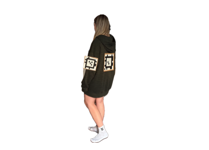
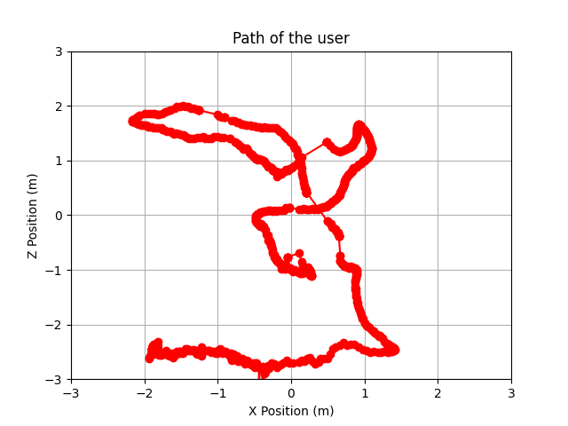

# Human Real-Time Tracking System with AprilTags

## Overview

This project was part of my master's thesis.
I needed a cheap and simple **real-time** tracking system to determine the position of people in a room.
Most tracking systems are either very expensive or very complicated to calibrate.
I thought that it might be useful for others too.

**All you need is a webcam and some cardboard.**

The tracking system is based on the visual fiducial system **_Apriltags_** from the [APRIL Robotics Laboratory at the University of Michigan](https://april.eecs.umich.edu/software/apriltag).

[Apriltag Repository](https://github.com/AprilRobotics/apriltag)

The project also includes several helper tools. I found out that there are no nice and simple tools for actually tasks like camera calibration.

## Features

- Real-Time Human Tracking: Tracks the position and orientation of a person in real-time using AprilTags.
- Camera Calibration: Calibrates the camera using a chessboard pattern to correct lens distortion and ensure accurate tracking.
- Visualization: Visualizes the paths of the tracked person.
- Data Handling: Returns the position, orientation, and rotation data. Data transmitted via UDP, but anything else can be used.

## Prerequisites

Before setting up the project, ensure you have the following installed:

- Python 3.x
- OpenCV (cv2)
- Numpy (numpy)
- Matplotlib (matplotlib)
- AprilTag Python bindings

#### AprilTag Python bindings

The Python bindings have to be installed as described in the [Apriltag Repository](https://github.com/AprilRobotics/apriltag).

Installing the Apriltag Python bindings can be very challenging. 
It took me some time to get it working.
First, C code has to be compiled and it was not clear where the Python package would be stored and how it can used it in the project. 
There are also a few pre-built Python bindings, as described in the Apriltag repository, but they didn't work for me.

In my case, the Python version was the problem. It worked with **Python version 3.12**.

## Setup

### 1. Camera Calibration

The camera needs to be calibrated to correct lens distortion. Follow these steps:

#### 1.1. Capture Calibration Images:

First, you have to take photos of a chessboard to calibrate the camera.
Since it was complicated to always take photos myself, I developed a tool that automatically takes photos.

- **Print out a chessboard:**

    Use a standard chessboard pattern (10x7 inner corners by default).
In the directory camera-calibration there is a PDF file with the chessboard pattern. 
This can be printed out on DIN A4 and glued to a flat piece of cardboard.
You just have to make sure that the printer does not scale it.

- **Run the following script to capture calibration images from your webcam:**

    `python src/camera-calibration/calibration_image_creator.py`

- **Capture images**

  Move the chessboard around in the frame, ensuring the entire board is visible and evenly lit.
The script will automatically save images when the chessboard is detected and sufficiently moved.

#### 2. Calibrate the Camera

After capturing the images, run the calibration script:

`python src/camera-calibration/camera_calibration.py`

This will generate a `camera_calib.npz` file containing the camera matrix and distortion coefficients.

You can also check the calibration with the file `check_calibration.py`.

### 3. Human Tracking

After calibrating the camera, you can start tracking:

#### 3.1. Attach AprilTags

First, you have to print out the Apriltags. There are 4 different tags in the project. There is also a PDF with two tags that are 15 cm in size and two that are 20 cm in size. If you adjust the size of the tags, you also have to adjust it in the code.

Attach AprilTags to the person you want to track. By default, the system uses tags with IDs for the front, back, and shoulders.
In my case, I attached two tags to the front and back, and two tags at each shoulder, as shown in the photo below.

#### 3.2. Start Tracking

Run the tracking script:

`python src/main.py`

## Usage

#### Tracking Visualization

The system visualizes the live tracking data directly on the video feed. The tags detected on the person will be highlighted, and their position and orientation will be displayed.
When the tracking is stopped (by pressing `q`), a graphic is plotted with the positions of the person.

Looks like that:

**Data Logging:**
The position and orientation data can be logged for further analysis or visualization. You can modify the script to log data in a specific format or integrate it with other systems.
By default, the data is transmitted via UDP.